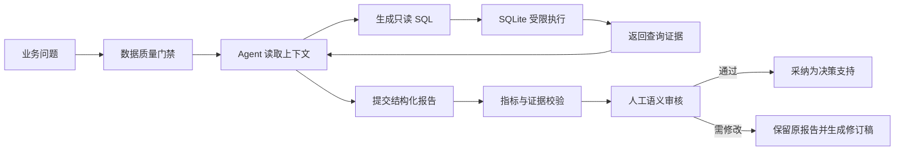

# Controlled Superstore Profitability Analysis Agent

一个面向盈利分析场景的受控 AI Agent 原型。它将自然语言业务问题转换为受限 SQL 工具调用，在本地 SQLite 中执行查询，生成带证据引用的结构化报告，并在任何业务结论被采纳前保留人工审核环节。

项目基于公开的 Sample Superstore 历史样本，重点验证以下问题：如何让大模型自主选择分析路径，同时限制其数据权限、校验关键事实，并阻止未经证据支持的因果结论和自动业务决策。

## 核心能力

- **受控工具调用**：模型只能调用 `get_context`、`run_sql` 和 `submit_report`，不能直接访问文件、Shell 或业务系统。
- **只读 SQL 沙箱**：SQLite authorizer、函数白名单、单语句限制、执行步数、超时、行数和字符数共同约束查询。
- **独立指标校验**：Pandas 参考计算独立核验销售额、profit、利润率和去重订单数，不把参考答案发送给模型。
- **证据级报告验证**：报告事实必须引用具体查询、行、列和值；排名主张需要声明比较列和方向，并由程序复算。
- **因果与行动边界**：观察性数据不能申报已估计因果效应，不能给出无依据的精确增量收益，也不能提交自动执行型业务动作。
- **人工审核与审计**：每次运行保存状态、查询、模型事件、usage、源码哈希和报告；原报告与后续审核、修订记录分离保存。
- **离线可复现**：无 API Key 时可使用固定模拟器验证完整软件链路；自动测试和 Evaluation 均不调用真实模型。

## 工作流程



自动校验只覆盖结构、核心数值、证据单元格、排名和部分语义边界。业务解释是否完整、调查优先级是否合理、建议是否可执行，仍由人工审核决定。

## 技术栈

- Python 3.13
- Pandas 3.0
- SQLite / Python `sqlite3`
- 阿里云百炼 `qwen-plus` Chat Completions Function Calling
- Python `unittest`
- JSON Schema 风格工具契约与本地报告验证器

项目不使用 LangChain 或其他 Agent 框架，工具循环、状态控制、审计和验证逻辑均由项目代码直接实现。

## 快速开始

### 1. 创建环境并安装依赖

```powershell
python -m venv .venv
.\.venv\Scripts\python.exe -m pip install -r requirements.txt
```

### 2. 获取并检查数据

```powershell
.\.venv\Scripts\python.exe scripts\fetch_data.py
.\.venv\Scripts\python.exe -m agent_b check
```

下载脚本固定数据源提交并核验 Git blob 与 SHA256。原始 CSV 和本地来源清单默认不提交到 Git。

### 3. 运行离线测试

```powershell
.\.venv\Scripts\python.exe -m unittest discover -s tests -v
.\.venv\Scripts\python.exe scripts\run_evals.py
.\.venv\Scripts\python.exe -m agent_b demo --category Furniture
```

`demo` 使用真实 SQLite 查询和固定模拟交互，不调用 LLM，也不代表模型准确率。

### 4. 可选：运行在线模型

先在本机环境变量中配置 `DASHSCOPE_API_KEY`，再执行：

```powershell
.\.venv\Scripts\python.exe -m agent_b ping --allow-cloud
.\.venv\Scripts\python.exe -m agent_b run --allow-cloud --category Furniture
```

`--allow-cloud` 表示明确允许将问题、字段说明、SQL 和查询结果发送给模型服务。原始 CSV 不会作为文件上传，但查询结果可能包含数据内容。在线运行可能产生费用。

完整参数、环境变量和人工审核命令见 [配置与运行](docs/01_配置与运行.md)。

## 验证结果

当前版本已完成：

| 检查 | 结果 |
|---|---:|
| 无网络单元测试 | 53 / 53 通过 |
| 固定报告 Evaluation | 12 / 12 通过 |
| 数据质量检查 | 9,994 条商品交易明细通过 |
| 离线端到端演示 | 到达 `awaiting_human_review`，真实 API 请求为 0 |
| Furniture 证据不足复验 | 正确拒绝精确估算取消折扣收益；人工修订闭环完成 |
| Office Supplies 换对象验收 | 查询和指标正确切换；人工修订闭环完成 |

详细测试记录见 [交付测试结果](docs/06_交付测试结果.md)，真实失败形成的回归案例见 [离线评测集](docs/08_离线评测集.md)。

## 示例输出

- [Furniture：折扣证据边界](examples/furniture_revised_report.md)
- [Office Supplies：分层排查方向](examples/office_supplies_revised_report.md)

示例是人工审核后的脱敏修订报告。原始模型消息、完整运行日志、审核姓名和本地路径保留在被忽略的 `runs/` 目录，不随公开仓库发布。

## 项目结构

```text
agent_b/                         核心 Agent、SQLite、验证和审计代码
scripts/fetch_data.py            固定来源下载与哈希校验
scripts/run_evals.py             离线报告 Evaluation 执行器
tests/                           无网络单元测试
evals/report_validation_cases.json
                                 固定真实失败案例
examples/                        脱敏修订报告示例
docs/                            配置、架构、故障、验证与项目总结
```

关键模块：

- `agent_b/data.py`：字段规范化、质量门禁和独立参考指标。
- `agent_b/database.py`：SQLite 只读授权和资源限制。
- `agent_b/contracts.py`：模型可见规则与工具定义。
- `agent_b/controller.py`：工具循环、停止条件和状态流转。
- `agent_b/validation.py`：报告结构、指标、证据、排名和因果边界校验。
- `agent_b/audit.py`：运行目录、日志脱敏、源码哈希和报告落盘。
- `agent_b/providers.py`：在线模型协议与离线模拟器。

架构与设计原理见 [架构与原理](docs/02_架构与原理.md)，项目验证过程见 [项目阶段总结](docs/09_项目阶段总结.md)。

## 文档

| 文档 | 内容 |
|---|---|
| [配置与运行](docs/01_配置与运行.md) | 环境变量、命令、状态和运行产物 |
| [架构与原理](docs/02_架构与原理.md) | 分层架构、数据粒度、工具调用和验证设计 |
| [运行与审核流程](docs/03_运行与审核流程.md) | 模式、状态机、自动验证和人工审核职责 |
| [故障排查](docs/04_故障排查.md) | 数据、SQL、模型、网络和报告问题 |
| [来源与验证记录](docs/05_来源与验证记录.md) | 数据来源、技术依据和验证边界 |
| [交付测试结果](docs/06_交付测试结果.md) | 本地测试、在线验收和修复记录 |
| [AI 辅助语义审核案例](docs/07_AI辅助语义审核案例.md) | 真实语义错误与审核闭环 |
| [离线评测集](docs/08_离线评测集.md) | 固定真实失败的报告 Evaluation |
| [项目阶段总结](docs/09_项目阶段总结.md) | 已完成案例、关键失败和当前边界 |

## 安全与边界

- API Key 只从环境变量读取，不写入代码、日志或报告。
- SQL 执行器拒绝写入、多语句、系统表、扩展加载和递归 CTE。
- `run` 有轮次、工具调用、上下文、输出和请求超时限制。
- `profit` 的完整业务成本口径未核对，报告不能擅自改称更具体的会计利润指标。
- 当前分析是观察性历史数据汇总，不进行因果识别，不能证明折扣导致或改善利润。
- 系统不连接真实业务执行端，不会自动调价、暂停权限或修改数据。
- 当前在线案例数量不足以估计模型总体准确率或长期稳定性。

## 数据与复现说明

数据来自公开 Superstore 样本的固定 Git 提交。仓库不重新分发 CSV；运行 `scripts/fetch_data.py` 可下载并校验指定版本。数据来源、提交、哈希和验证边界见 [来源与验证记录](docs/05_来源与验证记录.md)。

项目是研究与演示性质的受控分析原型，不是生产级数据平台或自动经营决策系统。
